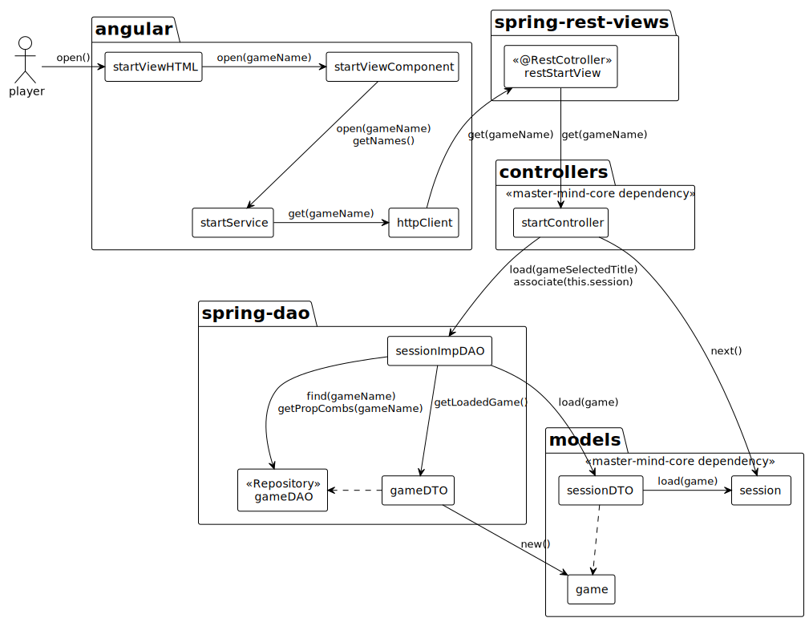
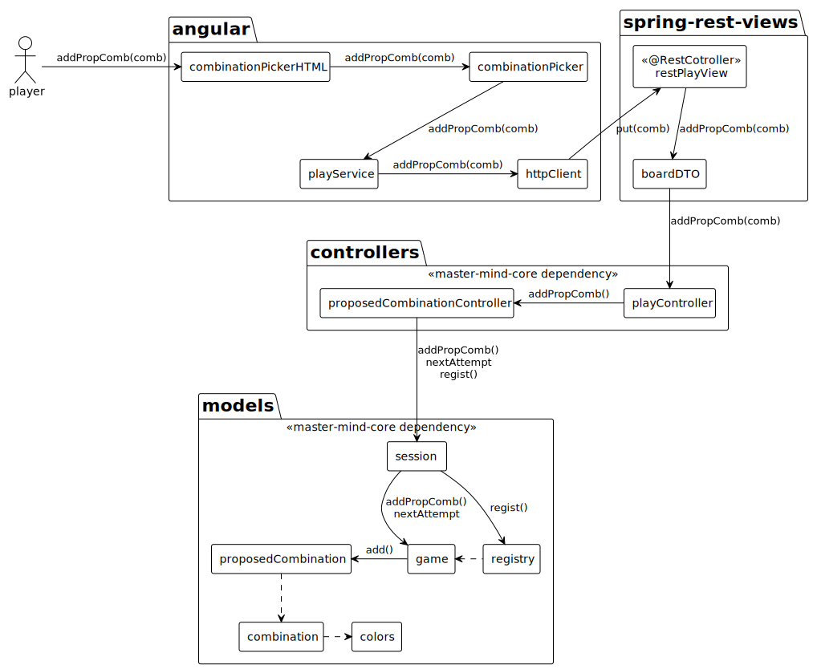

# Master Mind Web

### Index
- **[Description](#description)**
- **[Documentation](#documentation)**
  - **[Architecture Design](#architecture-design)**
  - **[Colaboration Diagram 'Open Case'](#colaboration-diagram-open-case)**
  - **[ProposeCombination Case](#colaboration-diagram-proposecombination-case)**
- **[User Interface](#user-interface)**

## Description
In the web distribution, I developed a Rest API using SpringBoot. The API implements the view interface from the core (maven dependency) as "end points" that are exposed to be consumed by an application website that was developed in Angular. In this way the logic and control of execution flow remains in the backend.

**[Here you can check the API code](https://github.com/PacoMorando/master-mind-api)**

**[Here you can check the core application documentation](https://github.com/PacoMorando/master-mind-core)**

## Documentation

### Architecture Design

### Colaboration Diagram 'Open Case'

### Colaboration Diagram 'ProposeCombination Case'

## User Interface

